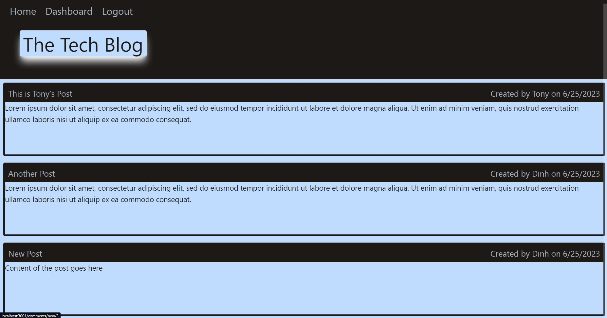

# Tech-Blog

## Description

I developed Tech Blog to be a user-friendly blog site that empowers developers to create an account, sign in, and publish their own posts. Users can explore a collection of posts published on the site and have the flexibility to edit or delete their own posts. With Tech Blog, developers can effortlessly share their thoughts, engage in discussions, and manage their blog content in a centralized platform.

During the development of this website, I gained valuable knowledge and skills in various areas. I learned how to render dynamic HTML using Handlebars.js, a powerful template engine that simplifies the process of generating HTML content. Implementing the MVC (Model-View-Controller) architecture allowed me to modularize the application and achieve a structured and organized codebase. I also gained experience in configuring Heroku, a popular platform for deploying web applications, specifically for applications that use MySQL as the database. Understanding the interactions between the Model, View, and Controller components enabled me to build a cohesive and efficient application flow. 

Additionally, I learned about the concept of separation of concerns, which emphasizes the division of responsibilities in code to enhance maintainability and scalability. Lastly, implementing user authentication provided a crucial layer of security and allowed users to create accounts, sign in, and manage their posts with confidence. Overall, the development of this website encompassed a wide range of skills, from front-end templating to back-end server logic and database management.

## Table of Contents
1. [Installation](#installation)
2. [Usage](#usage)
3. [Credits](#credits)
4. [Questions](#questions)  
5. [License](#license)

## Installation

- Download and install the Node.js LTS version from [Node.js](https://nodejs.org/en).
- Clone the repo using:

        git clone git@github.com:Dinh282/tech-blog.git

 - Or download the code from https://github.com/Dinh282/tech-blog.git and
open it with VS Code.       
- Make sure you are in the root path of the project folder and then install dependencies for the project with:

        npm i

- You would also need to download MySQL and start your database. 
- Set up the connection to the database by editing the server.js file. 
- Make sure you create and edit the .env file to reflect your MySQL username and password; so that you can make a successful connection to the MySQL database.
- You must log in to your MySQL Shell and source the schema.sql file. You can do so using this command:

        source schema.sql;  

- Once finished, exit the MySQL Shell.
- Make sure you are in the root path of the project folder before you start the app with this command:

        node server.js

- Open your web browser and go to localhost:3001.

## Usage

- Once you are on the main page of the website you can create your account.
- After signing up you will be authorized to create, view, edit, and delete your posts.
- On the home page, you will see all of the posts ever published on the site.
- You can click on a post to leave a comment if you are logged in.

- Alternatively, you can view the demo video or use test the site by visiting the live deployed site at: https://dn-tech-blog-91088954e7f1.herokuapp.com/.

---

Video Demo of Application:

https://github.com/Dinh282/tech-blog/assets/112836220/14a0e0d1-98fc-4a49-a71a-1ba4b4e13250

The following are screenshots the application:

Screenshot of the Homepage:

Screenshot of the Login Page:

Screenshot of the Sign-Up Page:

Screenshot of the Dashboard Page:

Screenshot of the Page to Create a Post:

Screenshot of the Page to Edit a Post:

Screenshot of the Homepage With Posts: 

Screenshot of the Page to a Leave a Comment:

Screenshot of the Comment Page:

## Credits:
1. https://www.npmjs.com/package/express-handlebars (Help with express handlebars)

2. https://expressjs.com/en/resources/middleware/session.html (Help with express sessions)

3. https://www.section.io/engineering-education/session-management-in-nodejs-using-expressjs-and-express-session/ ( Help with understanding sessions)

4. https://tailwindcss.com/docs/resize (Help with Tailwind framework)

5. https://developer.mozilla.org/en-US/docs/Learn/Server-side/Express_Nodejs/Introduction (Help with express)

6. https://www.npmjs.com/package/bcrypt (Help with Bcrypt)

7. https://developer.mozilla.org/en-US/docs/Web/API/Fetch_API/Using_Fetch(Help with fetch API)

8. https://devcenter.heroku.com/articles/jawsdb#:~:text=The%20JAWSDB_URL%20config%20variable%20will,the%20heroku%20config%3Aget%20command. (Help with deploying the application to Heroku)

9. https://www.youtube.com/watch?v=1G6e1cqqz3w&list=LL&index=1 (Help with deploying the application to Heroku)

10. https://www.youtube.com/watch?v=Rz886HkV1j4&list=LL&index=2 (Help with deploying the application to Heroku)

11. https://www.youtube.com/watch?v=AQp7b-1356k&list=LL&index=4 (Help with deploying the application to Heroku)

12. Instructor, TAs, and classmates.

## Questions
Feel free to contact me at nguyen_dinh282@yahoo.com for additional information.  
Also, check out my other projects on [GitHub](https://github.com/Dinh282)

## License

Please refer to the LICENSE section in the repository.

---
